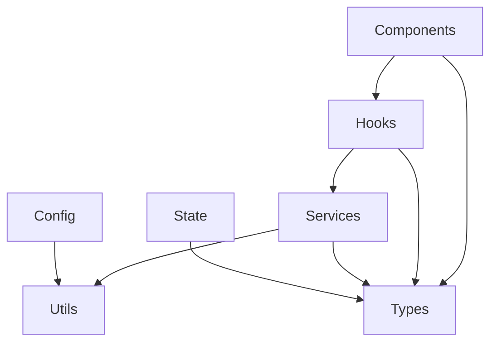

# 🏗️ Community Core 구현 전략 및 아키텍처

## 📋 목차
1. [전체 아키텍처 설계](#1-전체-아키텍처-설계)
2. [단계별 구현 전략](#2-단계별-구현-전략)
3. [패키지 설계 원칙](#3-패키지-설계-원칙)
4. [기술적 결정사항](#4-기술적-결정사항)
5. [성능 및 최적화 전략](#5-성능-및-최적화-전략)
6. [품질 보증 프로세스](#6-품질-보증-프로세스)

---

## 1. 전체 아키텍처 설계

### 1.1 패키지 아키텍처 개요

```
@semicolon/community-core
├── 🧩 Components Layer     # UI 컴포넌트 (Atomic Design)
├── 🪝 Hooks Layer          # 비즈니스 로직 추상화
├── 🔧 Services Layer       # API 통신 및 외부 서비스
├── 🛠️ Utils Layer          # 순수 유틸리티 함수
├── 📝 Types Layer          # TypeScript 타입 정의
├── 🏪 State Layer          # 상태 관리 (Redux/Context)
└── ⚙️ Config Layer         # 설정 및 초기화
```

### 1.2 계층별 책임 분리

**🧩 Components Layer**
- **Atoms**: 최소 단위 UI 컴포넌트 (버튼, 입력, 아이콘)
- **Molecules**: 조합된 UI 컴포넌트 (검색바, 페이지네이션)
- **Organisms**: 비즈니스 로직을 포함한 복합 컴포넌트

**🪝 Hooks Layer**
- **Common**: 범용 유틸리티 훅
- **Queries**: 데이터 페칭 훅 (React Query 기반)
- **Commands**: 데이터 변경 훅 (Mutation 기반)

**🔧 Services Layer**
- **BaseService**: HTTP 통신 추상화
- **Domain Services**: 도메인별 API 서비스
- **Authentication**: 인증/인가 처리

### 1.3 의존성 구조



---

## 2. 단계별 구현 전략

### Phase 1: 기반 구조 (✅ 완료)
- [x] 패키지 구조 설정
- [x] 빌드 시스템 구성 (Rollup)
- [x] TypeScript 설정
- [x] 기본 유틸리티 함수 export

### Phase 2: 핵심 서비스 레이어 (🔄 진행중)
```typescript
// 우선순위 구현 목록
- BaseService: HTTP 통신 기반 클래스
- UserService: 사용자 관리
- AuthService: 인증/인가
- 기본 유틸리티 함수들
```

### Phase 3: 훅 시스템
```typescript
// 핵심 훅 구현
- useGlobalLoader: 전역 로딩 상태
- useAuth: 인증 상태 관리
- usePermission: 권한 체크
- useDeviceType: 디바이스 타입 감지
```

### Phase 4: 컴포넌트 시스템
```typescript
// Atoms 우선 구현
- Button, Checkbox, Icon
- Skeleton, Toast
- 기본 Input 컴포넌트들

// Molecules
- Pagination
- SearchBar
- Tooltip

// Organisms
- GlobalLoader
- AuthGuard
- Navigation
```

### Phase 5: 상태 관리
```typescript
// Redux Toolkit 슬라이스
- userSlice: 사용자 상태
- globalSlice: 전역 UI 상태
- modalSlice: 모달 관리
```

### Phase 6: 고급 기능
```typescript
// 추가 기능들
- 이미지 최적화 유틸리티
- 다국어 지원
- 테마 시스템
- 성능 최적화 훅들
```

---

## 3. 패키지 설계 원칙

### 3.1 Framework Agnostic 설계

**Next.js 의존성 제거 전략:**
```typescript
// ❌ Next.js 종속적
import Link from 'next/link';
import Image from 'next/image';

// ✅ 추상화된 인터페이스
interface LinkProps {
  href: string;
  children: React.ReactNode;
  onClick?: () => void;
}

// 외부에서 구현체 주입
export const createComponents = (LinkComponent: React.ComponentType<LinkProps>) => ({
  NavigationLink: (props) => <LinkComponent {...props} />
});
```

### 3.2 설정 기반 초기화

```typescript
// 패키지 초기화 패턴
interface CoreConfig {
  apiUrl?: string;
  supabaseUrl?: string;
  supabaseAnonKey?: string;
  mediaProcessorUrl?: string;
  enableGlobalLoader?: boolean;
  theme?: 'light' | 'dark' | 'auto';
}

export const initializeCommunityCore = (config: CoreConfig) => {
  // 전역 설정 적용
  setGlobalConfig(config);
  
  // 서비스 인스턴스 생성
  return createServices(config);
};
```

### 3.3 Tree Shaking 최적화

```typescript
// 개별 export로 번들 크기 최적화
export { BaseService } from './services/BaseService';
export { UserService } from './services/UserService';
export { useAuth } from './hooks/useAuth';
export { Button } from './components/atoms/Button';

// 카테고리별 번들
export * as Components from './components';
export * as Hooks from './hooks';
export * as Services from './services';
export * as Utils from './utils';
```

---

## 4. 기술적 결정사항

### 4.1 빌드 시스템

**선택: Rollup**
- **이유**: 라이브러리에 최적화, Tree Shaking 지원 우수
- **대안**: Webpack (앱 빌드용), Vite (개발 서버용)
- **결과**: ESM + CJS 이중 빌드로 호환성 극대화

### 4.2 타입 시스템

**전략: 점진적 타이핑**
```typescript
// Phase 1: any 허용하여 빌드 성공
// Phase 2: 핵심 타입부터 strict 적용
// Phase 3: 전체 strict 모드 적용

interface StrictTypingRoadmap {
  phase1: 'Build Success First';
  phase2: 'Core Types Strict';
  phase3: 'Full Strict Mode';
}
```

### 4.3 의존성 관리

**PeerDependencies 전략:**
```json
{
  "peerDependencies": {
    "react": "^18.0.0 || ^19.0.0",
    "react-dom": "^18.0.0 || ^19.0.0",
    "next": "^13.0.0 || ^14.0.0 || ^15.0.0"
  },
  "dependencies": {
    // 패키지 핵심 기능에만 필요한 최소 의존성
    "axios": "^1.8.1",
    "lodash": "^4.17.21"
  }
}
```

### 4.4 모듈 시스템

**Hybrid Export 전략:**
```javascript
// package.json exports field 활용
{
  "exports": {
    ".": {
      "require": "./dist/index.js",
      "import": "./dist/index.esm.js",
      "types": "./dist/index.d.ts"
    },
    "./components": "./dist/components/index.js",
    "./hooks": "./dist/hooks/index.js",
    "./services": "./dist/services/index.js",
    "./utils": "./dist/utils/index.js"
  }
}
```

---

## 5. 성능 및 최적화 전략

### 5.1 번들 크기 최적화

**Tree Shaking 최적화:**
```typescript
// ✅ Named exports 사용
export const formatNumber = (num: number) => { ... };
export const formatDate = (date: Date) => { ... };

// ❌ Default export는 Tree Shaking 어려움
export default {
  formatNumber,
  formatDate
};
```

**Code Splitting 지원:**
```typescript
// 큰 컴포넌트는 동적 import 지원
export const LazyDataTable = React.lazy(() => 
  import('./components/organisms/DataTable')
);
```

### 5.2 런타임 최적화

**메모이제이션 전략:**
```typescript
// 비싼 계산은 기본적으로 메모화
export const useExpensiveCalculation = (data: any[]) => {
  return useMemo(() => {
    return heavyProcessing(data);
  }, [data]);
};
```

### 5.3 개발 경험 최적화

**개발 모드 지원:**
```typescript
// 개발 모드에서만 경고/디버깅 정보 제공
if (process.env.NODE_ENV === 'development') {
  console.warn('Community Core: Development mode enabled');
}
```

---

## 6. 품질 보증 프로세스

### 6.1 테스트 전략

```typescript
// 테스트 피라미드
├── Unit Tests (70%)     # 유틸리티, 훅, 서비스
├── Integration (20%)    # 컴포넌트 + 훅 조합
└── E2E Tests (10%)      # 전체 플로우
```

### 6.2 타입 안전성

**점진적 타입 강화:**
```typescript
// Phase 1: 기본 타입
interface User {
  id: string;
  name: string;
}

// Phase 2: 제네릭 활용
interface ApiResponse<T> {
  data: T;
  success: boolean;
}

// Phase 3: 고급 타입
type UserPermissions = 'read' | 'write' | 'admin';
```

### 6.3 버전 관리

**Semantic Versioning:**
- **MAJOR**: 브레이킹 체인지 (API 변경)
- **MINOR**: 새 기능 추가 (하위 호환)
- **PATCH**: 버그 수정

---

## 7. 마이그레이션 가이드

### 7.1 기존 프로젝트 적용

```typescript
// Before: 기존 프로젝트
import { Button } from '@/components/atoms/Button';
import { useAuth } from '@/hooks/useAuth';

// After: 패키지 사용
import { Button, useAuth } from '@semicolon/community-core';

// 또는 개별 import
import { Button } from '@semicolon/community-core/components';
import { useAuth } from '@semicolon/community-core/hooks';
```

### 7.2 설정 마이그레이션

```typescript
// 프로젝트 최상단에서 초기화
import { initializeCommunityCore } from '@semicolon/community-core';

initializeCommunityCore({
  apiUrl: process.env.NEXT_PUBLIC_API_URL,
  supabaseUrl: process.env.NEXT_PUBLIC_SUPABASE_URL,
  supabaseAnonKey: process.env.NEXT_PUBLIC_SUPABASE_ANON_KEY,
});
```

---

## 8. 성공 지표 및 KPI

### 8.1 기술적 지표
- 📦 **번들 크기**: < 500KB (minified + gzipped)
- 🚀 **빌드 시간**: < 30초
- 📊 **Tree Shaking**: > 80% 사용되지 않는 코드 제거
- 🎯 **TypeScript 커버리지**: > 90%

### 8.2 개발자 경험 지표
- ⚡ **설치 후 첫 사용**: < 5분
- 📚 **문서 완성도**: 모든 public API 문서화
- 🔄 **업데이트 편의성**: 자동 마이그레이션 가이드

### 8.3 비즈니스 지표
- 🔄 **재사용률**: > 3개 프로젝트에서 사용
- 🛠️ **유지보수 시간**: 50% 감소
- 🚀 **개발 속도**: 30% 향상

---

## 9. 로드맵

### Q1 2025: Foundation
- [x] 패키지 구조 완성
- [x] 빌드 시스템 구축
- [ ] 핵심 서비스 레이어 완성
- [ ] 기본 유틸리티 함수 세트

### Q2 2025: Core Features
- [ ] 훅 시스템 완성
- [ ] Atoms 컴포넌트 완성
- [ ] 상태 관리 시스템
- [ ] 타입 정의 완성

### Q3 2025: Enhancement
- [ ] Molecules/Organisms 컴포넌트
- [ ] 고급 훅들
- [ ] 성능 최적화
- [ ] 테스트 커버리지 80%+

### Q4 2025: Production Ready
- [ ] 완전한 타입 안전성
- [ ] 종합 문서화
- [ ] 실제 프로젝트 적용
- [ ] 커뮤니티 피드백 반영

---

## 10. 기여 가이드라인

### 10.1 개발 워크플로우
1. **Issue 생성**: 기능 요청 또는 버그 리포트
2. **브랜치 생성**: `feature/기능명` or `fix/버그명`
3. **개발**: TDD 기반 개발
4. **테스트**: 모든 테스트 통과 확인
5. **PR 생성**: 상세한 변경사항 설명
6. **코드 리뷰**: 팀 리뷰 후 머지

### 10.2 코딩 컨벤션
- **TypeScript**: 엄격한 타이핑 적용
- **ESLint**: Airbnb 스타일 가이드 기반
- **Prettier**: 일관된 코드 포맷팅
- **Conventional Commits**: 커밋 메시지 규칙

---

## 📞 문의 및 지원

- **GitHub Issues**: 버그 리포트 및 기능 요청
- **Discussions**: 아키텍처 및 설계 논의
- **Wiki**: 상세한 개발 가이드

이 문서는 프로젝트 발전에 따라 지속적으로 업데이트됩니다.