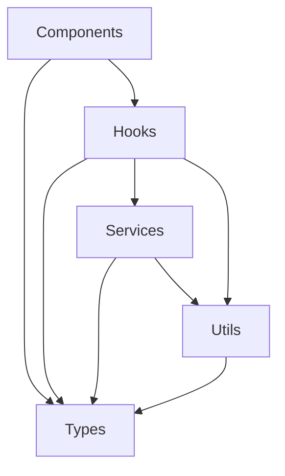

# 🏗️ @team-semicolon/community-core 아키텍처

## 📋 목차
- [패키지 구조](#패키지-구조)
- [계층별 아키텍처](#계층별-아키텍처)
- [의존성 관리](#의존성-관리)
- [빌드 시스템](#빌드-시스템)
- [설계 원칙](#설계-원칙)

## 패키지 구조

```
@team-semicolon/community-core
│
├── lib/                     # 소스 코드 (src 대신 lib 사용)
│   ├── components/          # UI 컴포넌트 (Atomic Design)
│   │   ├── atoms/          # 기본 UI 요소
│   │   ├── molecules/      # 조합된 컴포넌트
│   │   └── organisms/      # 비즈니스 로직 포함 컴포넌트
│   │
│   ├── hooks/              # Custom React Hooks
│   │   ├── common/         # 범용 유틸리티 훅
│   │   ├── queries/        # React Query 데이터 페칭
│   │   └── commands/       # 데이터 변경 및 액션
│   │
│   ├── services/           # API 서비스 레이어
│   │   ├── base/          # BaseService 클래스
│   │   └── domains/       # 도메인별 서비스
│   │
│   ├── utils/             # 순수 유틸리티 함수
│   ├── types/             # TypeScript 타입 정의
│   ├── constants/         # 상수 정의
│   └── index.ts          # 메인 진입점
│
├── dist/                  # 빌드 출력
├── storybook/            # Storybook 문서
└── docs/                 # 프로젝트 문서
```

## 계층별 아키텍처

### 🧩 Components Layer

**Atomic Design Pattern**을 따른 컴포넌트 구조:

```typescript
// Atoms: 최소 단위 컴포넌트
export interface ButtonProps {
  variant?: 'primary' | 'secondary' | 'ghost';
  size?: 'sm' | 'md' | 'lg';
  loading?: boolean;
}

// Molecules: 조합된 컴포넌트
export interface SearchBarProps {
  placeholder?: string;
  onSearch: (query: string) => void;
  loading?: boolean;
}

// Organisms: 비즈니스 로직 포함
export interface AuthGuardProps {
  requiredLevel?: number;
  adminOnly?: boolean;
  children: React.ReactNode;
}
```

### 🪝 Hooks Layer

**Custom Hooks 계층 구조**:

1. **Common Hooks**: 범용 유틸리티
   - `useAuth`: 인증 상태 관리
   - `useGlobalLoader`: 전역 로딩 상태
   - `usePermission`: 권한 체크

2. **Query Hooks**: 데이터 페칭 (React Query)
   - `usePostQuery`: 게시글 조회
   - `useUserQuery`: 사용자 정보 조회
   - `useBoardQuery`: 게시판 정보 조회

3. **Command Hooks**: 데이터 변경
   - `useCreatePostCommand`: 게시글 생성
   - `useUpdateUserCommand`: 사용자 정보 수정

### 🔧 Services Layer

**HTTP 통신 추상화**:

```typescript
// BaseService: 모든 서비스의 기반 클래스
export class BaseService<T = any> {
  protected async get<R = T>(url: string): Promise<CommonResponse<R>>
  protected async post<R = T>(url: string, data?: any): Promise<CommonResponse<R>>
  protected async put<R = T>(url: string, data?: any): Promise<CommonResponse<R>>
  protected async delete<R = T>(url: string): Promise<CommonResponse<R>>
}

// Domain Service 예시
export class UserService extends BaseService<User> {
  async getMyInfo(): Promise<CommonResponse<User>>
  async updateProfile(data: UpdateProfileDto): Promise<CommonResponse<User>>
}
```

## 의존성 관리

### 의존성 구조



### Peer Dependencies

```json
{
  "peerDependencies": {
    "react": ">=18.0.0",
    "react-dom": ">=18.0.0",
    "@tanstack/react-query": ">=5.0.0",
    "@reduxjs/toolkit": ">=2.0.0"
  }
}
```

## 빌드 시스템

### Rollup 설정

**이중 빌드 전략**:
- ESM 빌드: 모던 브라우저 및 번들러
- CJS 빌드: Node.js 및 레거시 환경

```javascript
// rollup.config.js 핵심 설정
export default [
  {
    input: 'lib/index.ts',
    output: [
      { file: 'dist/index.js', format: 'cjs' },
      { file: 'dist/index.esm.js', format: 'esm' }
    ],
    external: [...Object.keys(peerDependencies)],
    plugins: [
      typescript(),
      resolve(),
      commonjs(),
      preserveDirectives() // "use client" 보존
    ]
  }
];
```

### Tree Shaking 최적화

```typescript
// ✅ Tree Shaking 친화적
export { Button } from './components/atoms/Button';
export { useAuth } from './hooks/common/useAuth';

// ❌ Tree Shaking 방해
export default { Button, useAuth };
```

## 설계 원칙

### 1. Framework Agnostic

Next.js 종속성 최소화:
```typescript
// ❌ 프레임워크 종속적
import Link from 'next/link';

// ✅ 추상화된 인터페이스
interface NavigationProps {
  href: string;
  children: React.ReactNode;
}
```

### 2. Minimal Dependencies

외부 의존성 최소화:
- 필수 의존성만 포함
- Peer Dependencies 활용
- 번들 사이즈 최적화

### 3. Type Safety

완전한 TypeScript 지원:
```typescript
// 모든 export에 타입 정의
export interface User {
  id: string;
  name: string;
  level?: number;
}

export const formatUser = (user: User): string => {
  return `${user.name} (Level ${user.level || 0})`;
};
```

### 4. Progressive Enhancement

점진적 기능 향상:
```typescript
// 기본 기능
export const Button: React.FC<ButtonProps> = (props) => { ... };

// 선택적 고급 기능
export const ButtonWithTooltip: React.FC<ButtonWithTooltipProps> = (props) => { ... };
```

### 5. Performance First

성능 최적화:
- Lazy Loading 지원
- Code Splitting 친화적
- 메모이제이션 활용

## 버전 관리

**Semantic Versioning**:
- MAJOR: 호환성을 깨는 변경
- MINOR: 하위 호환 기능 추가
- PATCH: 하위 호환 버그 수정

**현재 로드맵**:
```
v1.8.x - 메시징 시스템
v1.9.x - Realtime 기능
v2.0.0 - 완전한 커뮤니티 코어 패키지
```